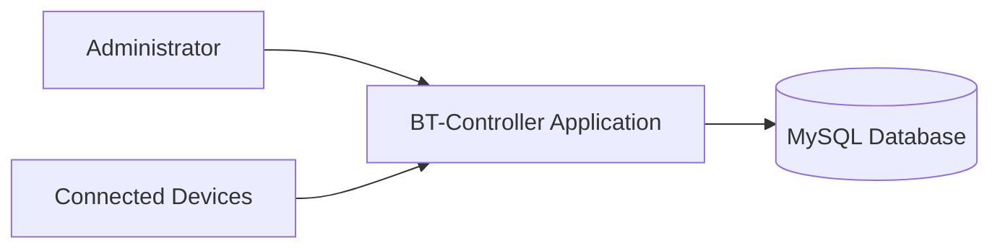

# BT-Controller


BT-Controller is an open-source system designed to **manage and control devices connected to an Internet Spot environment** such as cybercafés, coworking spaces, or shared internet access networks.

The system allows administrators to monitor and manage both **shop-owned devices** and **client-owned devices** connecting to the network.

Repository:

https://github.com/BT-Technologies/BT-Controller

---

# Overview

Originally, BT-Controller was designed to manage **devices owned by the shop**, such as public desktop computers available for customers.

Over time the project evolved to support **client-owned devices**, allowing administrators to manage modern usage scenarios where users bring their own devices.

Typical devices include:

- Desktop computers
- Laptops
- Tablets
- Smartphones
- Other internet-enabled devices

---

# Project Information

| Item | Description |
|-----|-----|
| Project Name | BT-Controller |
| Organization | BT-Tech Developers Labs |
| Language | C++ |
| Framework | Qt |
| IDE | Qt Creator |
| Database | MySQL |
| Application Type | Desktop Administration System |

---

# Features

| Feature | Status | Description |
|---|---|---|
| Device Registration | Implemented | Register devices connected to the system |
| Shop Device Management | Implemented | Manage devices owned by the internet spot |
| Client Device Support | Implemented | Register devices belonging to customers |
| Device Monitoring | In Progress | Track active connected devices |
| Internet Session Control | Planned | Control internet access time |
| Usage Statistics | Planned | Generate reports and analytics |
| Web Admin Panel | Planned | Remote management interface |

---

# Supported Devices

| Device Type | Supported | Notes |
|---|---|---|
| Desktop Computers | Yes | Shop devices |
| Laptops | Yes | Shop / Client devices |
| Tablets | Yes | Client devices |
| Smartphones | Yes | Client devices |
| Other Devices | Planned | Future support |

---

# Technology Stack

| Layer | Technology |
|---|---|
| Programming Language | C++ |
| Framework | Qt Framework |
| Interface | Qt Widgets |
| Database | MySQL |
| Development Environment | Qt Creator |

---

# System Architecture



The system acts as a central controller between administrators and devices connected to the internet spot.

---

# Project Structure

```
BT-Controller/
│
├── src/                # Application source code
├── database/           # SQL schema and scripts
├── docs/               # Documentation
├── assets/             # Images, icons, UI resources
├── build/              # Build output
└── README.md
```

---

# Installation

## Requirements

Before building the project, make sure you have:

- Qt Creator
- Qt Framework
- MySQL Server
- C++ Compiler compatible with Qt

---

## Setup

Clone the repository:

```bash
git clone https://github.com/BT-Technologies/BT-Controller.git
```

Open the project in **Qt Creator**.

Configure the **MySQL database connection**.

Import the database schema from the `database` folder.

Build and run the project.

---

# Database Components

| Table | Purpose |
|---|---|
| devices | Stores registered devices |
| clients | Stores client information |
| sessions | Tracks device connection sessions |
| configuration | Stores system configuration |

---

# Roadmap

| Version | Planned Features |
|---|---|
| v0.2 | Device monitoring |
| v0.3 | Internet session control |
| v0.4 | Usage statistics |
| v0.5 | Web administration panel |

---

# Contributing

Contributions are welcome.

| Step | Action |
|---|---|
| 1 | Fork the repository |
| 2 | Create a feature branch |
| 3 | Commit your changes |
| 4 | Submit a Pull Request |

---

# Maintainers

| Name | Organization |
|---|---|
| BT-Tech Developers Labs | Project Maintainers |

---

# License

This project is released as **open-source software**.

A specific license (MIT / GPL / Apache) will be defined in the repository.

---
